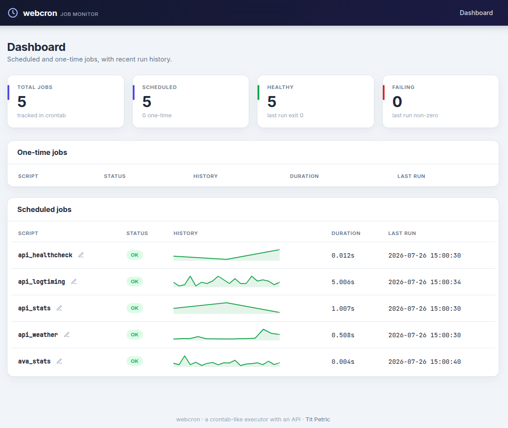
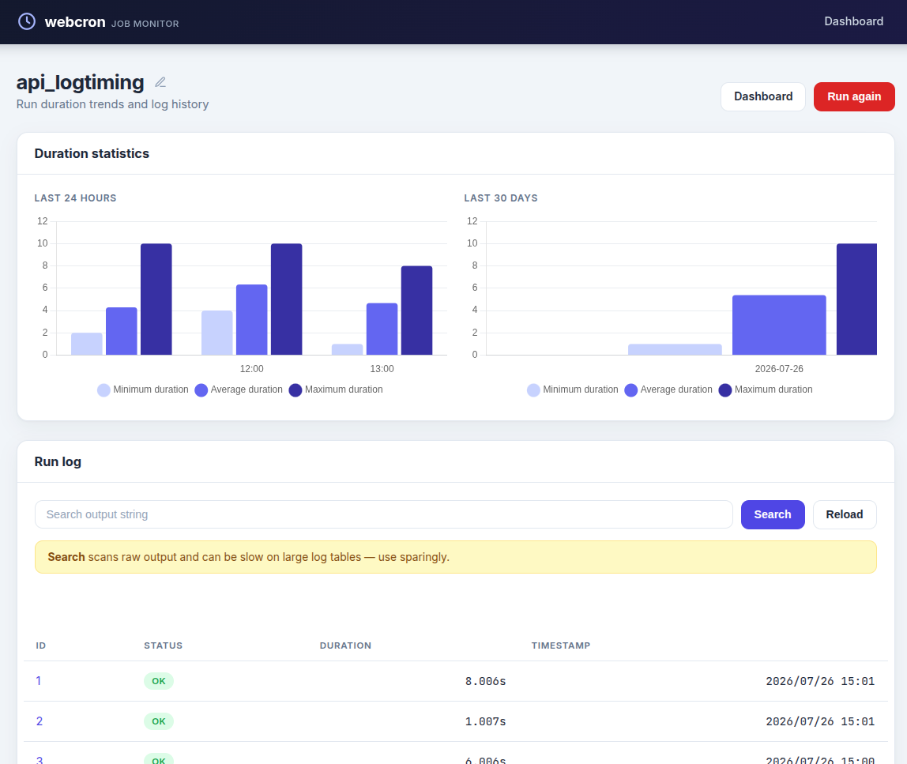

# go-web-crontab - Automation runner for scheduled tasks.

This is an automation runner that picks up schedules from
`cron.d/*.cron` and runs scripts referenced in `cron.scripts`. Older
versions of this software were used at [RTV Slovenia](https://rtvslo.si)
for a number of years.

One of the first versions of the front-end just collected the logs of
`crontab -L2` and created a historical view of task execution, including
any performance or stability information (latency, failure rate,
timeouts, ...).

## Screenshots





## Usage

The published Docker image includes the dashboard and the example jobs from
`cron.d` and `cron.scripts`. The included [`compose.yml`](compose.yml) starts
the dashboard on [http://localhost:3000](http://localhost:3000) and stores the
SQLite database in a named volume:

```yaml
services:
  webcron:
    image: titpetric/go-web-crontab:latest
    environment:
      PLATFORM_DB_CRONTAB: sqlite://data/webcron.db
    ports:
      - "3000:8080"
    volumes:
      - webcron-data:/data

volumes:
  webcron-data:
```

To mount your own scripts and crontab schedule files, mount them as:

- `/app/cron.d` - for all the `*.cron` files
- `/app/cron.scripts` - for all the automation scripts

To package your own automation bundle, you can use the following
Dockerfile as a template.

```Dockerfile
FROM titpetric/go-web-crontab:latest

RUN rm -rf /app/cron.d/* /app/cron.scripts/*

COPY ./cron.d /app/cron.d
COPY ./cron.scripts /app/cron.scripts
```

Start the service with Docker Compose:

```bash
docker compose up -d
```

The app can also be installed from source:

```bash
CGO_ENABLED=0 go install github.com/titpetric/go-web-crontab/cmd/webcron@latest
```

## About

The project uses a few core packages to bind together functionality:

| Project                                                                  | Usage                                                                 |
|--------------------------------------------------------------------------|-----------------------------------------------------------------------|
| [github.com/go-bridget/mig](https://github.com/go-bridget/mig)           | Database migrations, database model code generation                   |
| [github.com/titpetric/phpscript](https://github.com/titpetric/phpscript) | Front-end phpscript runtime, minimal dashboard layout                 |
| [github.com/titpetric/pdo](https://github.com/titpetric/pdo)             | A request-lived database connection object, type safe generic methods |

Written by [Tit Petric](https://titpetric.com).
